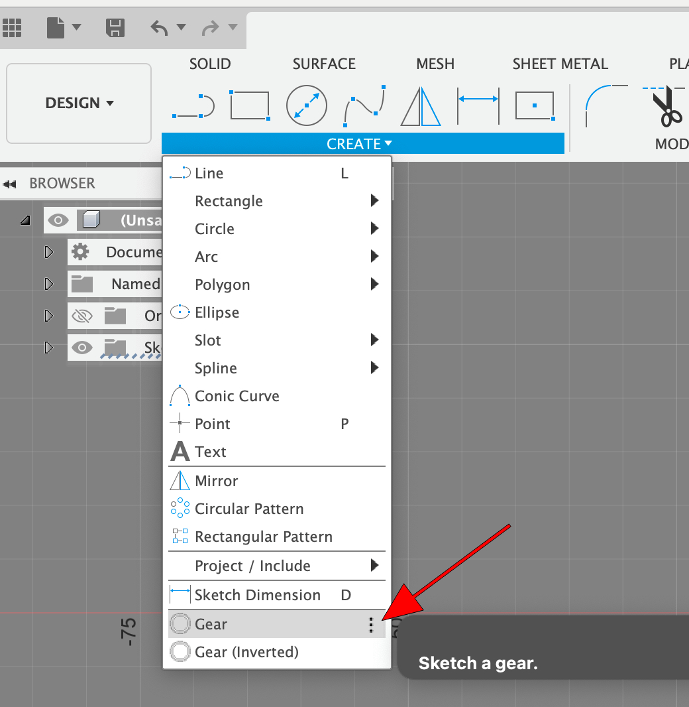
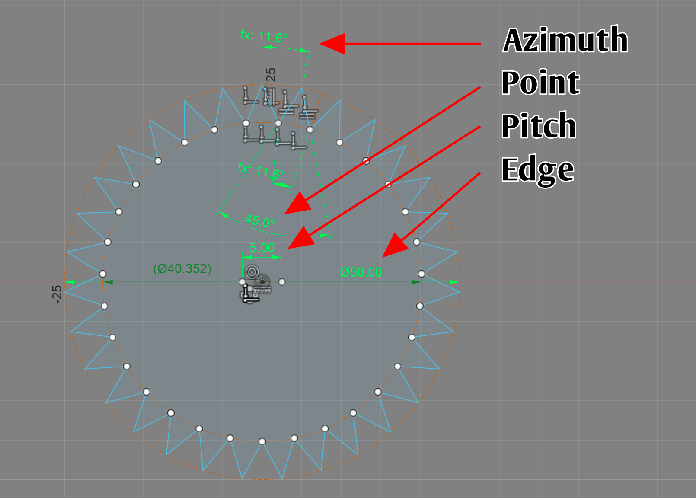

# com.autodesk.fusion360.addins.teeth
 *Adds gear options to the sketch create menu*

## Install

* Download: https://github.com/DataDink/com.autodesk.fusion360.addins.teeth/archive/refs/heads/main.zip
* Drop the "Teeth" folder into the Fusion360 addins folder
  * **Windows:** C:\Users\Your User Name\AppData\Roaming\Autodesk\Autodesk Fusion 360\API\AddIns
  * **Mac:** /Users/Your User Name/Library/Application Support/Autodesk/Autodesk Fusion 360/API/AddIns
* (Re)start Fusion360

## Usage

The menu item will add a new gear to the sketch.

The gear can then be configured by adjusting its dimensions:

* **Orientation:** The rotation of the gear.
  * This dimension can be deleted and a coincident with one of the teeth can be used instead.
* **Spacing:** The distance between the teeth.
  * Set this to the same value for all of the gears that will be interlocking.
  * The actual spacing will vary slightly based on the gear radius.
* **Radius:** This is the radius of the gears edge.
  * For inverted gears this will be the inner point of the teeth.

## Safety

It is wise to do your own sweep on plugin code, yourself, before installing.
This applies to anything downloaded from unofficial sources (like this).
Here are some things to look for:

* **Executable Code:** Identify the files that have executable code in them (e.g. Teeth.py)
  * Look for internet addresses that might be maliciously transmitting your information or downloading content...
    * IP Addresses (e.g. 10.98.162.3)
    * Web Addresses (e.g. somehackersite.com)
  * Look for file paths that might be maliciously accessing your files...
    * Hard Drives (e.g. c:\something or ~/something etc.)
    * Path Variables (e.g. %USER% or %DOCUMENTS% etc.)
  * Look for information gathering...
    * This is harder to identify
    * Look for variable names like "username", "account", etc.
* **Compiled Binaries:** Identify executable files that aren't human-readable.
  * File extensions may give these away (e.g. file.dll, file.bin, file.exe)
  * Files with unknown or no extension that show a bunch of garbled data in a text editor.

The existence of these things doesn't make a plugin malicious.
If you see these things it is just a good idea to do some research.
Here are some measures to take:

* IP addresses are a red flag. Credible communications should use registered domain sites (e.g. something.com)
* Google "is (website/filename) safe?"
  * There are numerous services (some more credible than others) that collect this data and a search will give you a larger set of opinions.
* Search for (don't navigate to) references to web and IP addresses.
  * If you don't get many hits it becomes more suspect
* Do a "whois" lookup on web and IP addresses
  * These lookups are less useful than they used to be, but can still give you insight about the owner of these addresses.

## Links

* **Source:** https://github.com/DataDink/com.autodesk.fusion360.addins.teeth
* **Issues:** https://github.com/DataDink/com.autodesk.fusion360.addins.teeth/issues

## Notes

* **v0.0.0**
  * Feature: Adds "Gear" and "Gear (Inverted)" to the "Create" menu in the "Sketch" space
  * Feature: Draws a gear in the sketch so that the dimensions can be edited (no inputs/dialogs needed)
  * Fix: Fixes an invalid command identifier
  * Fix: Fixes an initialization issue
