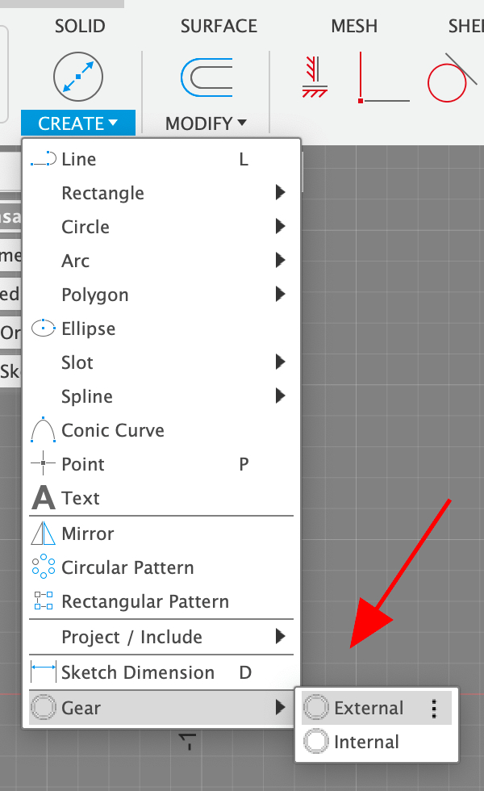

# com.autodesk.fusion360.addins.teeth
 *Adds gears to the sketch create menu*

## Install

* Drop the "Teeth" folder into the Fusion360 addins folder
  * **Windows:** C:\Users\Your User Name\AppData\Roaming\Autodesk\Autodesk Fusion 360\API\AddIns
  * **Mac:** /Users/Your User Name/Library/Application Support/Autodesk/Autodesk Fusion 360/API/AddIns
* (Re)start Fusion360

## Usage

The menu item will add a new gear to the sketch.

The gear can then be configured by adjusting its dimensions:

* **Orientation:** The rotation of the gear.
  * This dimension can be deleted and a coincident with one of the teeth can be used instead.
* **Spacing:** The distance between the teeth.
  * Set this to the same value for all of the gears that will be interlocking.
  * The actual spacing will vary slightly based on the gear radius.
* **Radius:** This is the radius of the gears edge.
  * For inverted gears this will be the inner point of the teeth.

## Links

* **Source:** https://github.com/DataDink/com.autodesk.fusion360.addins.teeth
* **Issues:** https://github.com/DataDink/com.autodesk.fusion360.addins.teeth/issues

## Notes

* **v0.0.0**
  * Adds "Gear" and "Gear (Inverted)" to the "Create" menu in the "Sketch" space
  * Draws a gear so that the dimensions can be edited (no inputs/dialogs needed)
